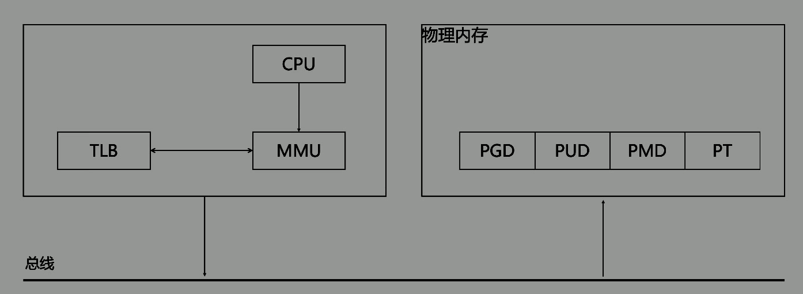
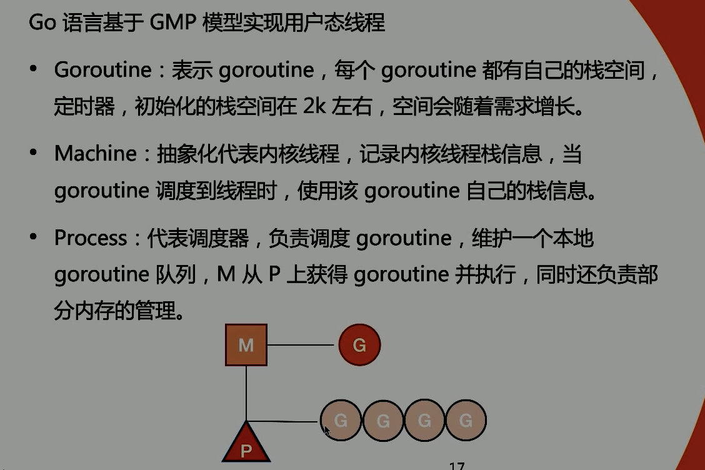
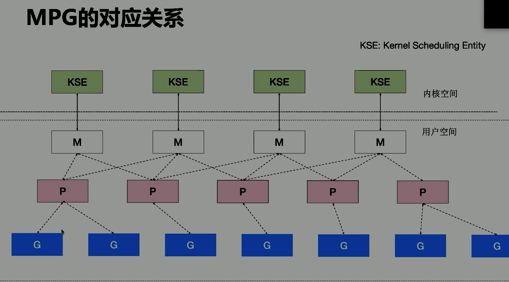
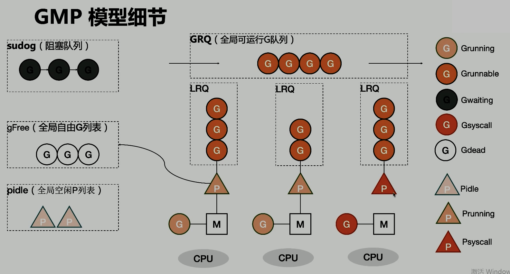
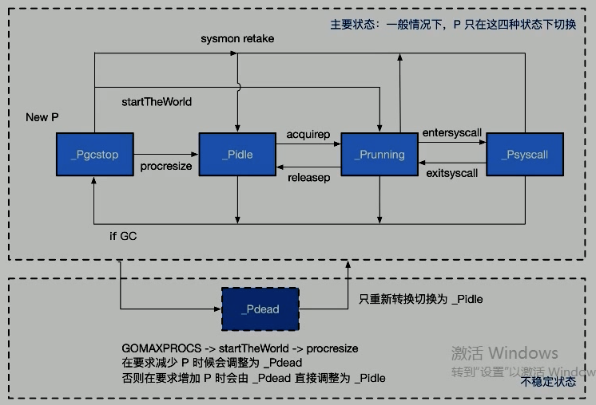
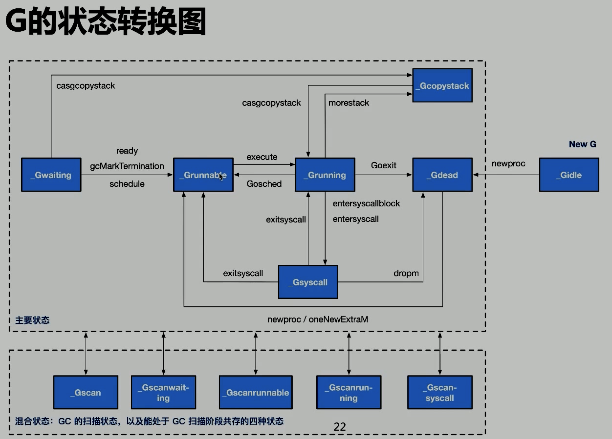

# GO 語言特性

Go 是一個`編譯高效`，`支持高併發`，`面向垃圾回收`的全新語言。

## Linux thread

### 虛擬地址

- Kernel space
- 環境參數變量
- Stack
- 未分配內存
- Heap
- BSS: 未初始化數據
- Data: 初始化數據，Go的話沒有靜態變量，相應的數據是 runtime管理
- Text: 代碼

### 物理內存

- PGD: page global directory
- PUD: page upper directory
- PMD: page middle directory
- PT: page table

## CPU 對內存的訪問

- CPU 有 Memory Management Unit (MMU) 單元
- MMU 表示`虛擬地址`和`物理地址`映射關係
- CPU 維護 Translation Lookaside Buffer，緩存`虛擬地址`和`物理地址`映射關係
- (CPU -> MMU <-> TLB) -> 總線 -> (物理內存)

## 進程切換開銷

- 直接開銷
  - 切換 page 目錄
  - 內核態StackHeap
  - 硬件上下文
  - 刷新TLB
  - 系統調度器的執行
- 間接開銷
  - CPU 緩存失效導致的進程需要到內存直接訪問的 IO 操作變多

## 線程切換開銷

- 本質只是一批共享資源的進程，切換依然要系統調用
- 但是因為共用內存資源，所以所有線程共享`虛擬地址空間`，切換時節省了`虛擬地址空間的切換(TLB)`

## 用戶線程

無需內核，攜程的創建和銷毀完全在用戶態完成。

## Goroutine

Go 語言基於`GMP`模型實現用戶態線程

GMP基本概念：

GMP對應關係：

GMP模型細節：

## P的狀態

- idle： 空閒
- running： 被線程 M 持有，並且正在執行用戶代碼或者調度器
- syscall： 沒有執行用戶代碼，陷入系統調用
- gcstop： 但前處理器由於 GC 被停止
- dead： CPU 不用

P的狀態轉換圖：

## G的狀態

- idle：G剛初始化
- runnable：可執行的G
- running：執行代碼的G
- syscall：執行系統調用，與 P 脫離， 綁定到 M 上
- waiting：等待中的G
- dead：可能是剛初始化的G，也可能是執行了goexit而退出的G
- copystac：Stack被copy中的G
- scan：GC正在掃描Stack，可與其他狀態同時存在

G的狀態轉換圖：

## 調度器P行為

- 為了防止 `全局的運行隊列` 中的 G 餓死，schedtick 會有一定機率 (1/61) 去`全局運行隊列` 找G調用
- 從 M 本地的運行隊列中 查找執行的 G
- 如果前兩種方法都沒找到 G，會通過 runtime.findrunnable `進行阻塞地查找` Goroutine
  - 從本地、全局隊列中找
  - 從網絡輪詢器中找
  - 通過 runtime.runqsteal 嘗試從隨機的處理器中竊取一半待運行的。
