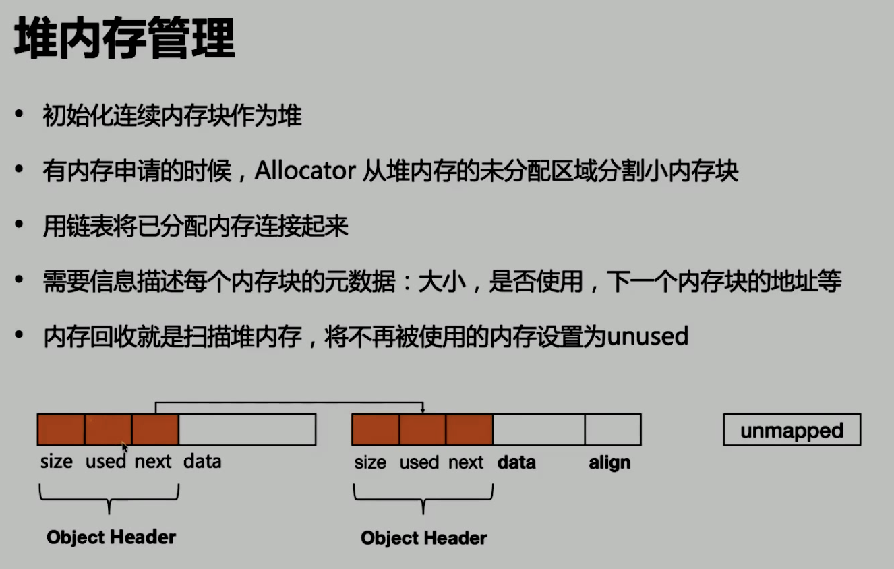
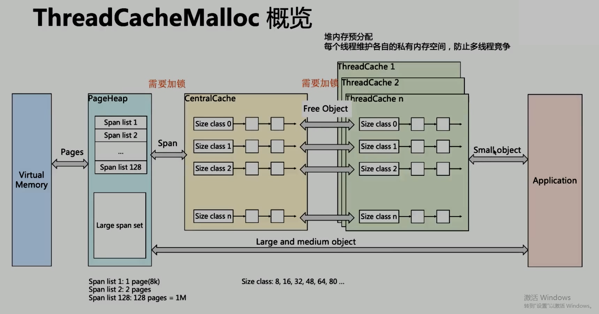
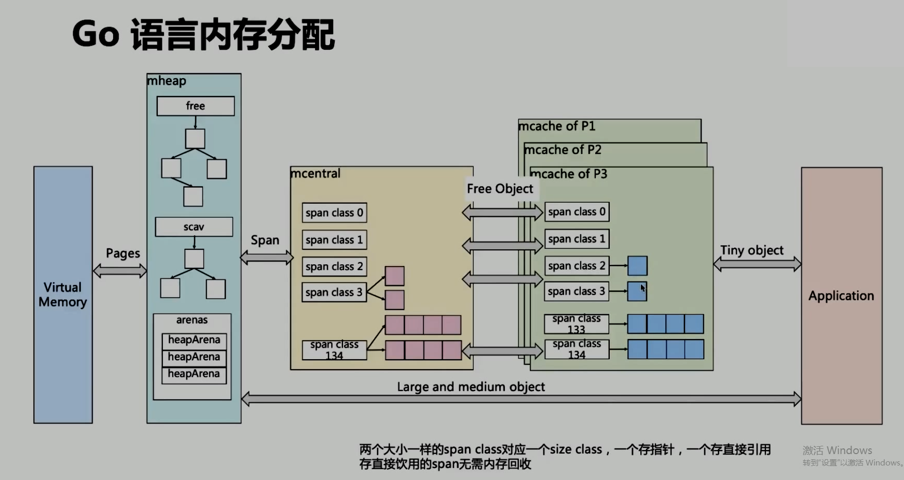

# GC

## Heap 內存管理

- (Heap<-)Allocator：內存分配器，處理動態內存分配請求
- Mutator(->Allocator)：用戶程序，通過 Allocator 創建對象
- (Colletor<-)Object Header(->Allocator)：Collector 和 Allocator 同步對象元數據
- Collector(->Heap)： 垃圾回收器，回收內存空間。

Heap 內存管理

## ThreadCacheMalloc

TCMalloc概覽

- page: 8K
- span: 內存塊，一個或多個 page
- sizeclass：span 的 size class
- object：對象，假設 obj = 16b，span = 8K，那 span 就能分成 8k/16b = 512個 obj，分配的話就分配 1 個 obj 出去

- obj 大小定義
  - 小： 0 ～ 256k
  - 中： 256k ～ 1M
  - 大： > 1M
- 小的分配流程：
  - TC -> CentralCache -> HeapPage，大部分時候，TC緩存都是足夠的，不需要走向下層。無系統調用配合無鎖分配，所以分配效率非常高。
- 中：直接在 PageHeap中選適當的大小。128 Page = 1M
- 大： 從 large span set 選擇合適數量的頁面組成 span，用來存儲數據。

## Go語言的內存分配

重點：兩個大小一樣的Span Class 對應一個 size class，一個存指針，一個存直接引用，直接引用的span無需內存回收。

## 三色標記

- GC 開始時，所有 obj 都是`白色`，即垃圾
- 從 root 區開始遍歷，被找到的 obj 變灰
- 遍歷灰色 obj， 內部有應用的話，自己變黑，引用變灰
- 循環上面這步，直到沒有`灰色` obj 了，只剩黑白， 白色就是垃圾
- 黑色 obj 在標記期間發生了寫操作，寫屏障會在真正賦值前將新對象標記為`灰色`
- 標記過程中，mallocgc 新分配的 obj，會先被標記成`黑色`再返回。

## GC 觸發機制

- 內存分配量達到閾值觸發
  - 每次內存分配時都會檢查當前內存分配量是否達到閾值,如果達到就啟動 GC
    - 閾值 = 上次 GC 內存分配量*內存增長率
    - 內存增長率由環境變量 GOGC 控制, 默認為 100, 即每當內存擴大一倍時啟動 GC.
- 定期觸發: 默認情況下, 最長 2 分鐘觸發一次 GC, 這個間隔在 src/runtime/proc.go:forcegcperiod 變量中被聲明.
- 手動觸發: 程序代碼中可以用 runtime.GC() 來手動觸發 GC. 主要用於 GC 性能測試和統計.

`go mod init`: 初始化
`go mod tidy`: 找 go 項目裡的依賴

## Docker 優勢總結

### 封裝性

- 不需要啟動內核, 所以應用擴縮容時可以秒速啟動
- 資源利用率高, 直接使用宿主機內核調度資源, 性能損失小
- 方便的 CPU, 內存資源調整
- 能實現秒級快速回滾
- 一鍵啟動所有依賴服務, 測試不用為搭建環境犯愁, PE 也不用為建站複雜而擔心
- 鏡像一次編譯, 隨處使用
- 測試, 生產環境高度一致(數據除外)

### 鏡像增量分發

- 由於採用了 Union FS, 簡單來說就是支持將不同的目錄掛載到同一個虛擬系統下, 並實現一種 layer 的概念, 每次發佈只傳輸變化的部分, 節約帶寬

### 隔離性

- 應用的運行環境和宿主環境五官, 完全由鏡像控制, 一台物理機上部署多種環境的測試鏡像
- 多個應用版本可以並存在機器上
  
### 社區活躍

- Docker 命令簡單, 易用, 社區十分活躍, 周邊組建豐富
