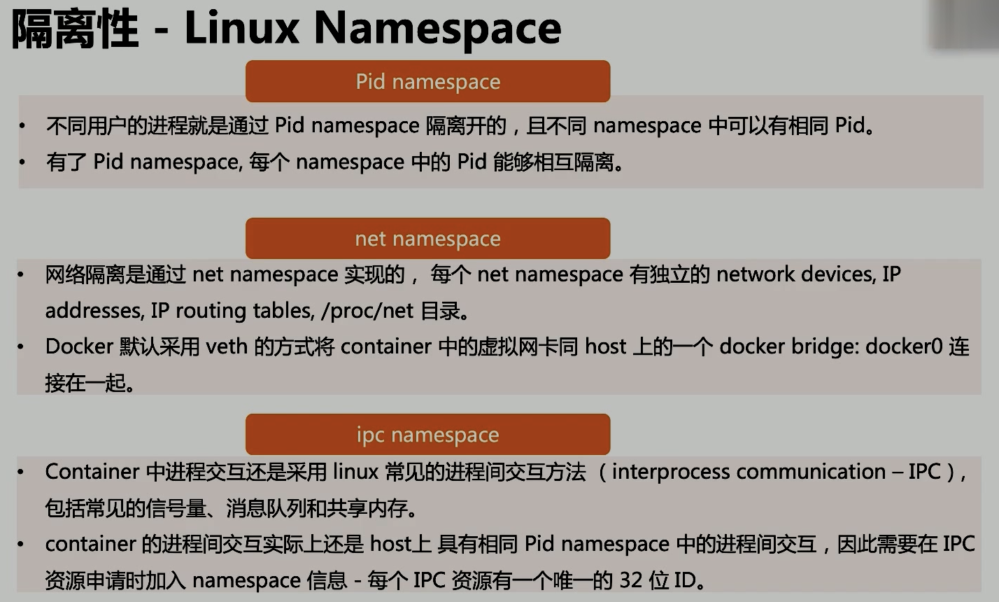

# Docker

## 為什麼用 Docker

- 高效地利用系統資源
- 更快的啟動時間
- 一致的運行環境
- 持續交付和部署
- 更輕鬆的遷移
- 更輕鬆的維護和擴展

## VM 和 Container 的區別

VM: 多了 Hypervisor 和 Guest OS

Docker: Docker Engine 取代了 Hypervisor

## Docker 操作

TODO: nsenter learning

- run
  - -it: 交互
  - -d: deamon 後台操作
  - -p: 端口映射
  - -v: 磁盤掛載
- start: 啟動已終止的容器
- stop: 停止容器
- ps: 查看容器進程
- inspect `containerID`: 查看容器內容
- attach: 進入容器
  - 通過  nsenter -> PID = $(docker inspect --format "{{.State.Pid}}") `container`) -> nsenter --target $PID --mount --uts --ipc --net --pid
- cp `file1` `container`:/file/to/path: copy 文件到指定目錄

```dockerfile
# 生成 container
FROM ubuntu
ENV MY_SERVICE_PORT=80
ENV MY_SERVICE_PORT1=80
ENV MY_SERVICE_PORT2=80
ENV MY_SERVICE_PORT3=80
LABEL multi.lable1="value1" multi.lable2="value2" other="value3"
ADD bin/amd64/httpserver /httpserver
EXPOSE 80
ENTRYPOINT /httpserver
```

## 容器標準

- Open Container initiative (OCI)
  - Runtime Specification: 文件系統如何解壓至硬盤, 供運行時運行
  - Image Specification: 如何通過構建系統打包, 生成鏡像清單(Manifets), 文件系統序列化文件, 鏡像配置.

## 容器主要特性

- 安全性: 天然隔離
- 隔離性: namespace
- 便攜性: overlayfs
- 可配額: cgroup

## Namespace

- Linux Kernel 的資源隔離方案
  - 系統可以為進程分配不同的 Namespace
  - 不同 namespace 有著不同的配置, 對主機來說可能有映射關係



### 常用操作

- lsns -t `type`: 查看當前系統的 namespace
- ls -la /proc/`pid`/ns/: 查看某進程的 Namespace
- nsenter -t `pid` -n ip addr:  進入某 namespace 運行命令

## Cgroups

- Linux 下用於對進程進行資源控制和監控的機制
- 可以對 CPU 使用時間, 內存, 磁盤 I/O 等進程所需的資源進行限制
- 不同資源的管理應有 Cgroup 的子系統來實現
- 針對不同資源的管理限制, 只要將限制策略在不同的子系統上進行關聯即可

## vruntime 紅黑樹

- 自平衡, 樹上沒有一條路徑會比其他路徑長兩倍
- O(log n) 時間複雜度, 能夠在樹上進行快速的插入和刪除進程
