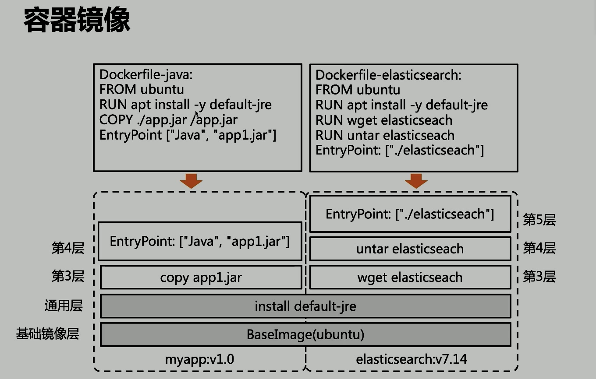
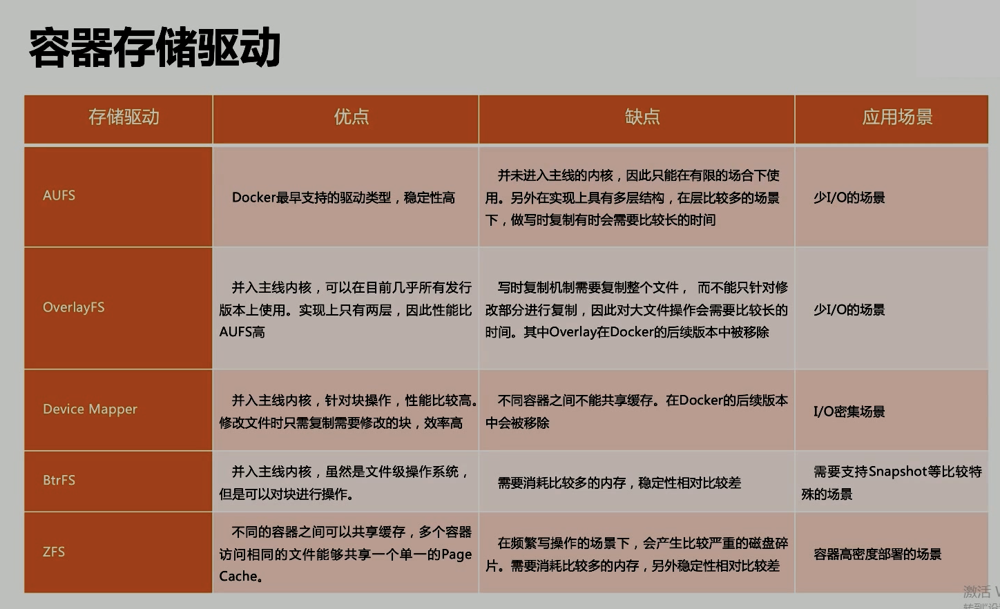
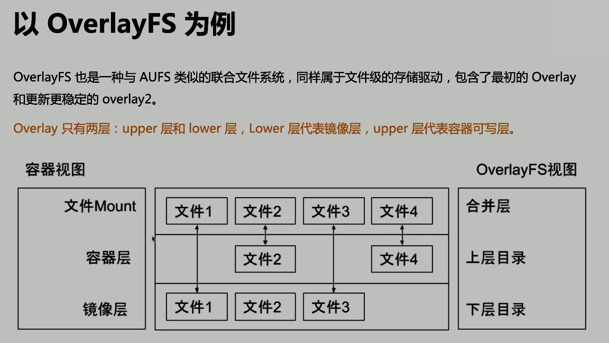

# Docker2

## 文件系統

`Docker 的創新點`

### Union FS

- `將不同目錄掛載到同一個虛擬文件系統` 的文件系統
- 支持為每一個成員目錄設定 readonly, readwrite and whiteout-able 權限
- 文件系統分層, 對 readonly 權限的 branch 可以邏輯上進行修改(增量地, 不影響 readonly 部分的)
- 通常 Union FS 有兩個用途, 一方面可以將多個 disk 掛到同一個目錄下, 另一個更常用的就是將一個 readonly 的 branch 和一個 writeable 的 branch 聯合在一起

## 容器鏡像

Java:

```Dockerfile
FROM ubuntu
RUN apt install -y default-jre
COPY ./app.jar /app.jar
# 制定啟動時用的文件
EntryPoint ["Java", "app1.jar"]
```

elasticseach:

```Dockerfile
FROM ubuntu
RUN apt install -y default-jre
RUN wget elasticseach
RUN untar elasticseach
# 制定啟動時用的文件
EntryPoint ["./elasticseach"]
```



每層都有`checksum`, 通過 dockerfile 創建 image 時, 會通過`checksum`判斷是否可以複用

這表示: docker 用了一種通用的方法解決了文件分發的問題(增量分發)

## Docker 的文件系統

### 典型的 Linux 文件系統組成

- Bootfs (boot file system)
  - Bootloader: 引導加載 kernel
  - Kernel: 當 kernel 被加載到內存後 umount bootfs.
- rootfs (root file system)
  - /def, /proc, /bin, /etc 等標準文件和目錄
  - 對於不同的 linux 發行版, bootfs 基本是一致的, 但 rootfs 會有差別.

## Docker 啟動

- Linux:
  - 啟動後, 首先將 rootfs 設置為 readonly, 進行一系列檢查, 然後將其切換為"readwrite" 供用戶使用.
- Docker 啟動:
  - 初始化時也是將 rootfs 以 readonly 方式加載並檢查, 然而接下來利用 union mount 的方式將一個 readwrite 文件系統掛載在 readonly 的 rootfs 之上;
  - 並且允許再次將下層的 FS 設定為 readonly 並且向上疊加
  - 這樣一組 readonly 和一個 writeable 的結構構成一個 container 的運行時態, 每一個 FS 被稱作一個 FS 層

### 小結

對於 docker(容器)來說, 是沒有 bootfs 的(複用主機的 kernel), 但是每一個進程需要看到自己的文件系統, 所以它有單獨的 rootfs, 所以進程看到的是 docker 的 fs

### 寫操作

#### 寫時複製

一個鏡像可以被多個容器使用, 但是不需要再內存和磁盤上做多個拷貝. 在需要對鏡像提供的文件進行修改時, 該文件會從鏡像的文件系統被`複製`到容器的`可寫層的文件系統`進行修改, 而鏡像裡的文件不會改變. 不同容器對文件的`修改都相互獨立, 互不影響`.

#### 用時分配

按需分配空間, 而非提前分配, 即當一個文件被創建出來以後, 才會分配空間.

容器存儲驅動的比較


### Overlay FS 例子



- 合併層文件優先級: 容器層(上層) > 鏡像層(下層)

## 網絡

解決統一主機下容器的網絡互通問題

不同主機下容器的網絡互通問題如何解決

- Overlay:
  - 通過網絡封包實現
- Remote:
  - Underlay: 使用現有底層網絡, 為每一個容器配置可路由的網絡 IP
  - Overlay: 網絡封包

### Null 模式

- `docker run -it -p 8888:80 nginx`
  - `8888:80`: 主機的 8888 端口映射成容器的 80 端口
  - `Nginx`: container's name

## 理解構建上下文 (build context)

reference: [Docker Build 工作原理](https://blog.csdn.net/qianghaohao/article/details/87554255)

- `send xxx to docker daemon`: 先加載要傳進 docker 的東西, 然後再執行`ADD xxx`動作
- `docker build` 默認查找當前目錄的 dockerfile 作為構建輸入, 也可以通過 -f 制定 dockerfile
  - docker build -f ./Dockerfile
- 當`docker build`運行時, 首先會把構建上下文傳給 docker daemon, 如果把沒用的文件包含在構建上下文時, 會導致`傳輸時間長`, `構建需要的資源多`,`構建出的鏡像大`等問題
  - 試著到一個包含文件很多的目錄運行下面的命令, 會感受到差異
    - docker build -f $GOPATH/src/../../../Dockerfile
    - docker build $GOPATH/src/../../../
    - 可以通過`dockerignore`文件從編譯上下文排除某些文件
- 因此需要確保構建上下文清晰,比如創建專門的目錄防止 dockerfile, 並在目錄中運行`docker build`

## Build Cache

構建容器鏡像時, docker 依次讀取 dockerfile 中的指令, 並按順序依次執行構建命令

- docker 讀取到指令後, 會先判斷緩存中是否有可用的已存鏡像, 只有已存鏡像不存在時才會重新構建
  - 通常 docker 簡單判斷 dockerfile 中的指令與鏡像
  - 針對`ADD`和`COPY`指令, docker 判斷該鏡像層每一個文件的內容並生成一個 checksum, 與現存鏡像相比較時, docker 比較的是兩者的 checksum
  - 其他指令, 如`RUN apt-get -y update`, docker 簡單比較與現存鏡像中的指令字串是否一致
  - 當某一層 cache 失效後, 後續指令都需重新構建
    - 最大化利用緩存: 變動小的放在下層(開頭), 變動多的放在上層(結尾)

## 多端構建(Multi-stage build)

```dockerfile
FROM golang:1.16(事先生成的鏡像) AS build(別名)
RUN apk add --no-cache git
RUN go get github.com/golang/../../..

COPY Gopkg.lock.Gopkg.toml /go/src/project/
WORKDIR /xx/xx/xxx/
RUN xxx

COPY . /xx/xx/xxx/
RUN go build -o /bin/project (只有這個是需要的, 上面的都是 waste)

FROM scratch(空的)
COPY --from=build /bin/project(build裡的) /bin/project(到 scratch 去)
ENTRYPOINT [*/bin/project/*]
CMD [*--help*]
```

## Dockerfile 常用指令

- FROM aa AS bb
- LABELS: 按標籤組織項目
  - LABELS multi.label1="value1" multi.label2="value2" other="value3"
  - 配合 lable filter 可過濾鏡像查詢結果
  - `docker images -f lable=multi.label1="value1"`
- RUN: 執行命令
  - 最常見的用法: `RUN apt-get update && apt-get install`
    - 這兩條命令應該永遠用`&&`連接, 如果分開執行, `RUN apt-get update` 構建層被緩存, 可能會導致新 package 無法安裝
    - 這種方法可以有效的減少 overlay FS 的層級
- CMD: 容器鏡像中包含應用的運行命令, 需要帶參數
  - `CMD ["executable", "param1", "param2"...]`
- EXPOSE: 暴露端口, 方便聲明
  - `EXPOSE <port> [<port> / <protocol>...]`
    - 是鏡像創建者和使用者的約定
    - 在 `docker run -P` 時, docker 會自動映射 expose 的端口到主機大端口, 如 0.0.0.0:32768 -> 80/tcp
- ENV 設置環境變量
  - `ENV <key> = <value> ...`
- ADD: 從源地址(文件, 目錄, URL) 複製文件到目標路徑
  - `ADD [--chown=<user>:<group>] <src>...<dest>`
  - `ADD [--chown=<user>:<group>] ["<src>",..."<dest>"]` 路徑有空格時使用
  - 支持 Go 風格的通配符, 如`ADD check* /testdir/`
  - 如果 src 是個本地壓索文件, 則在 ADD 的同時完成解壓操作
  - 如果 src 是 URL
    - 如果 dest 結尾沒有`/`, 則視為文件名, 否則則視為文件夾
    - 應盡量減少通過`ADD URL`添加 remote 文件, 建議使用 curl 或者 wget && untar
- COPY: 與 ADD 類似
  - 區別:
    - 不支持 URL
    - 不解壓文件
    - 語義更直白, 所以盡量用 COPY
- ENTRYPOINT: 定義可以執行的容器鏡像入口命令
  - `ENTRYPOIN ["exe", "param", "param2"...]`docker run 追加參數模式
  - `ENTRYPOINT command param1 param2` docker run 替換參數模式
  - ENTRYPOINT 的最佳實踐是用 ENTRYPOINT 定義鏡像主命令, 並通過 CMD 定義主要參數, 如下所示
    - `ENTRYPOINT ["s3cmd"]
    - `CMD ["--help"]

## Dockerfile 最佳實踐
kkk
TODO: 12 Factor

### 目標: 易管理, 少漏洞, 鏡像小, 層級少, 利用緩存

- 不要安裝無效軟件包
- 應簡化鏡像中 同時運行的進程數, 理想情況下, 每個鏡像應該只有一個進程
- 當無法避免同一鏡像運行多個進程時, 應選擇合理的初始化進程(init process)
- 最小化層數
  - 最新的 docker 只有 RUN, COPY, ADD 創建新層, 其他指令創建臨時層, 不會增加鏡像的大小
    - 比如 EXPOSE 指令就不會生層新層
  - 多條 RUN 命令可通過連接符(&&)連接成一條指令集以減少層數
  - 通過多段構建減少鏡像層數
- 把`多行參數`按`字母排序`, 可以減少可能出現的重複參數, 並且提高可讀性
- 編寫 Dockerfile 的時候, 應該把變更頻率低的編譯指令`優先構建`, 以便放在鏡像底層以有效利用 build cache
- 複製文件時, 每個文件應`獨立複製`, 這確保某個文件變更時, `只影響文件對應的緩存`

## 基於 Docker 鏡像的版本管理

- Docker tag
  - `docker tag 0exxxxxxx hub.docker.com/cncamp/httpserver:v1.0`
    - hub.docker.com: 默認 hub.docker.com
    - cncamp: repositry
    - httpserver: 鏡像名
    - v1.0: tag, 常用來記錄版本信息

