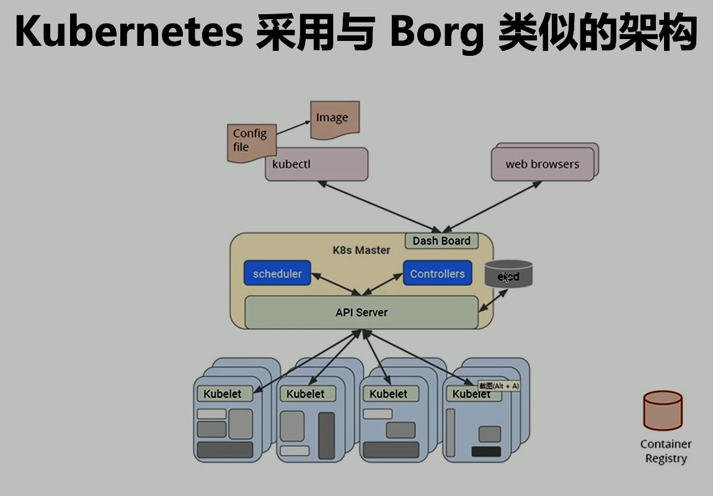

# Kubernetes 架構原則 和 對象設計

## Borg 隔離性

- 安全:
  - 前期 Chroot jail, 後期 Namespace
- 性能:
  - 基於 CGroup 的容器技術實現
  - 在線任務(prod)是延遲敏感(latency-sensitive)的, 優先級高, 而離線任務(non-prod, Batch)優先級低
  - Borg 通過不同優先級直線的搶佔式調度來優先保障在線任務的性能, 犧牲離線性能
  - Borg 將資源類型分為兩類
    - (compressible):可壓榨的, CPU 是可壓榨資源, 資源耗盡不會終止進程
    - (non-conpressible):不可壓榨的, 內存是不可壓榨資源, 資源耗盡進程就會被終止

## 什麼是 Kubernetes

簡單理解就是 Borg 的開源版本, 內容包括

- 基於容器的應用部署
- 負載均衡和服務發現
- 跨機器和跨地區的集群調度
- 自動伸縮
- 無狀態服務和有狀態服務
- 插件機制保證擴展性

## 命令式(imperative) vs 聲明式(Declarative)

- 聲明式關注做什麼
  - 我告訴你做什麼, 你自己會去做
  - 直接聲明: 直接告訴你我要什麼
  - 間接聲明: 我不直接告訴你我的需求, 我會把我的需求放在特定的地方, 請在方便的時候拿出來處理
- 命令式關注如何做
  - 我要怎麼做,你就怎麼做

- 冪等性: 狀態固定, 每次我要你做事, 請返回相同的結果
- 面向對象的: 把一切都抽象成對象

## Kubernetes: 聲明式系統

Kubernetes 的所有管理能力構建在對象抽象的基礎上, 核心對象包括:

- Node: 計算節點的抽象, 用來描述計算節點的資源抽象, 健康狀態等
- Namespace: 資源隔離的基本單位, 可以簡單理解為文件系統中的目錄結構
- Pod: 用來描述應用實例, 包括鏡像地址, 資源需求等. Kubernetes 中最核心的對象, 也是打通應用和基礎架構的秘密武器.
- Service: 服務如何將應用發佈成服務, 本質上是複雜均衡和域名服務的聲明.

## Kubernetes 架構圖

## Kubernets 的主節點

- API Server: 唯一帶有用戶可訪問 API 以及用戶可交互的組件. API 服務器會暴露一個 RESTful 的 Kubernetes API , 並用 JSON 格式的清單文件
- Cluster Data Store: Kubernetes 使用"etcd". 這一個強大的, 穩定的, 高可用的鍵值存儲, 被 Kubernetes 用戶長久存儲所有的 API 對象.
- 控制管理器: 被稱為"kube-controller manager", 它運行著所有處理集群日常任務的控制器. 包括了節點控制, 副本控制, 端點(endpoint)控制以及賬戶服務等
- Scheduler: 調度器會監控新建的 pod(一組或一個容器) 並將其分配給節點.

## etcd

etcd 是 CoreOS 基於 `Raft` 開發的分佈式 key-value 存儲, 可用於服務發現, 共享配置以及一致性保障(如數據庫選主, 分佈式鎖等)
TODO: Raft協議的工作原理

- 基本的 key-value 存儲
- 監聽機制(`長鏈接`代替`輪訓`)
- key 的過期及續約機制, 用戶監控和服務發現
- 原子 CAS 和 CAD, 用於分佈式鎖和 Leader 選舉

etcd 提供了消息存儲, 同時還有異步的消息機制(watch)

## API Server

- 認證
- 授權
- 准入

通過`Aggregator`, 我們可以自定義 API Server, 但是需要按照 k8s 的規範做.
