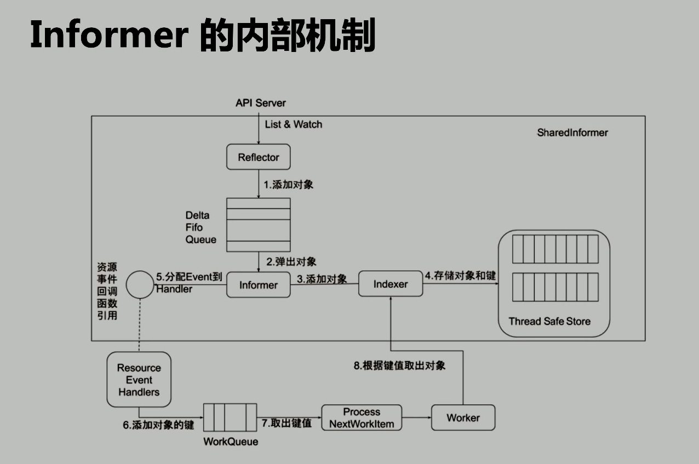
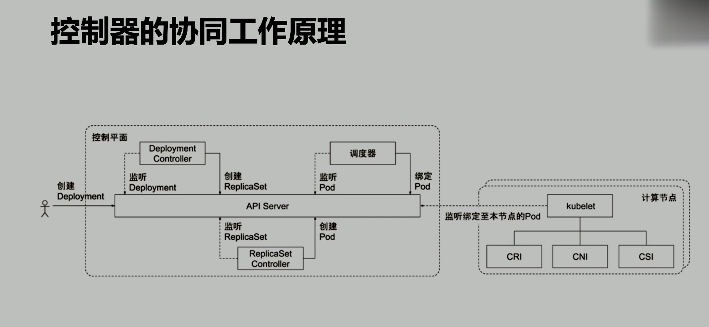
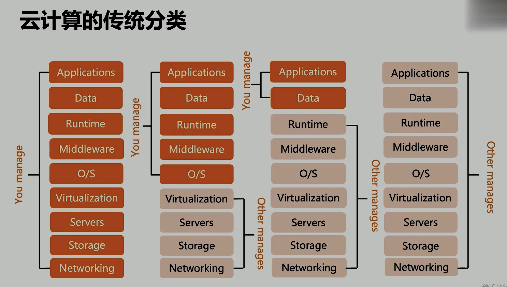
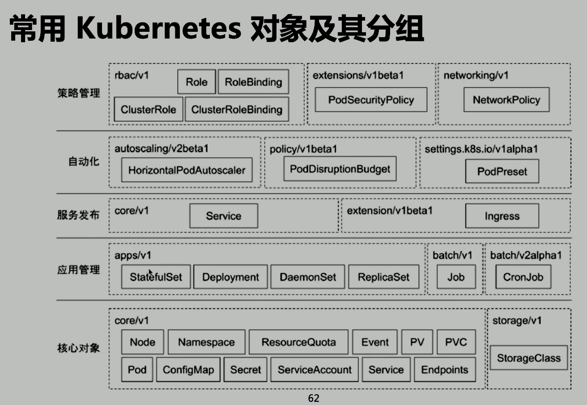

# k8s Rule2

## Controller Manager

- Controller Manager 是集群的大腦, 是確保整個集群動起來的關鍵
- 作用是確保k8s 遵循`聲明式系統`規範, 確保系統的`真實狀態`與用戶定義的`期望狀態`一致
- CM 是多個控制器的組合, 每個 C 事實上都是一個 control loop , 負責偵聽其管控的對象, 當對象發生變更時完成配置
- C 配置失敗通常會觸發自動重試, 整個集群會在控制器不斷重試的機制下確保`最終一致性`

### Informer 的內部機制

Informer 的內部機制

- Informer -> 長鏈接 -> list -> watch
- Thread Safe Store 存儲`namespace`,`pod`等
- 通過`Indexer`減少對 API Server 的訪問
- 對象變化, 發送到 Event 裡 -> 添加到`worker queue` -> 取出消費

- 寫 Worker 邏輯時
  - 應該不從 API Server 讀, 而從本地 Thread Safe Store 裡讀
  - 除非要更新

### 控制器的協同工作原理

控制器的協同工作原理

- ReplicaSet: 確保運行的 pod 的數量跟用戶期望的數量是一致的.
- 通過 Deployment 確保 k8s 運行 x 個實例

- Deployment: 會計算`template`後面字串的 Hash 值, 如果發現不一樣了, 就會 Scale down 舊的, Scale up 新的.

## Kubelet

Kubernetes 的初始化系統 ( init system )

- 從不同源獲取 Pod 清單, 並按需求啟停 Pod 的核心組件:
  - Pod 清單可從本地文件目錄, 給定的 HTTPServer 或 Kube-APIServer 等源頭獲取
  - Kubelet 將運行時, 網絡和存儲抽象成了 CRI(Container Runtime Interface), CNI, CSI.
- 負責匯報當前節點的資源信息和健康狀態
- 負責 Pod 的健康檢查和狀態匯報

## 推薦的 Add-ones

- kube-dns: 負責整個集群提供 DNS 服務
- Ingress Controller: 為服務提供外網入口
- MetricsServer
- ...

## Kubectl 命令和 kubeconfig

- kubectl是一個 k8s 的命令行工具, 允許 k8s 用戶以命令行的方式與 k8s 交互, 其默認讀取配置文件`~/.kube/config`
- kubectl 會將接收到用戶請求轉化為 rest 調用以 rest client 形式與 apiserver 通訊
- apiserver 的地址, 用戶信息等配置在`kubeconfig`

### kubectl 常用命令

- kubectl get po -oyaml -w
  - kubectl + 可查看對象
  - `-oyaml`: output yaml, 看`單獨對象`多
  - `-w`: watch 觀察後續變化
  - `-owide`: output 對象詳細信息, 看`全部對象`
- kubectl describe deploy
  - 重要是看 event
- kubectl exec -it conID bash
  - 進入容器
- kubectl logs:
  - 可以查看 pod 的標準輸入, 與 tail 用法類似

## 雲計算的傳統分類

1. 自己管完
2. 省去基礎架構
3. 只部署應用和資料(PaaS, 但是 PaaS 沒有固定規範)
4. 什麼都雲廠商提供了, 我們要有賬號密碼就行

## 分層架構

- 核心層: 對外提供 API 構建高層的應用, 對內提供插件式應用執行環境
- 應用層:
  - 部署: 無狀態, 有狀態, 批處理, 集群應用等
  - 路由: 服務發現, DNS 解析
- 管理層:
  - 系統調度: 基礎設施, 容器, 網絡的度量
  - 自動化: 自動擴展, 負載均衡
  - 策略管理: RBAS(權限), Quota(配額), PSP(安全策略), NetworkPolicy(網絡策略)
- 接口層:
  - kubectl, clientSDK 以及集群聯邦
- 生態系統:
  - k8s 外部: 日誌, 監控, 配置管理, cicd, workflow, FaaS, OTS 應用, ChatOps 等
  - k8s 內部: CRI, CNI, CVI, 鏡像倉庫, Cloud Provider, 集群自身的配置和管理等.服務發現, DNS 解析

## API 設計原則

- 所有 API 都應是聲明式的
  - 聲明式的操作都是允許重複操作的, 對於容易出現數據丟失或者重複的分佈式環境來說是很重要的
  - 聲明式操作更易被用戶使用, 可以使系統向用戶隱藏實現的細節, 同時也保留了系統未來持續優化的可能性
  - 聲明式的 API 還隱含了所有 API 對象都是`名詞性質`的, 如 Service, Volume 這些 API 都是名詞, 這些名詞描述了用戶所期望得到的一個目標對象
- API 對象是彼此互補且可組合的
  - 鼓勵 API 盡量實現 OOP 設計時的要求(功能拆分), 即`高內聚, 松耦合`
- 高層 API 以操作意圖為基礎設計
  - 如何設計好 API, 跟如何能用面對對象的方法設計好應用系統有相同的地方, 高層設計一定是從業務出發, 而不是過早的從技術實現觸發
  - 因此, 針對 k8s 的高層設計, 一定是以 k8s 的業務為基礎出發, 也就是以`系統調度管理容器的操作意圖`為設計基礎
- 底層 API 根據高層 API 的控制需要設計
  - 為了減少冗餘, 提高複用性, 底層 API 的設計也要以需求為基礎, 要盡量抵抗受技術實現影響的誘惑
- 盡量避免簡單封裝, 不要有在外部 API 無法明確知道內部隱藏的機制
  - 簡單的封裝, 實現沒有提供新的功能, 反而增加了對封裝 API 的依賴性
  - 例如 StatefulSet 和 ReplicaSet, 本來就是兩種 Pod 集合, 那麼 k8s 就用不同 API 對象來定義他們, 而不會說只用同一個 ReplicaSet, 在通過內部特殊的算法來區分這個 ReplicaSet 是有狀態還是無狀態的

## 架構設計原則

- 只有 APIServer 可以直接訪問 etcd 存儲, 其他服務器必須通過 k8s API 來訪問集群狀態
- 單節點故障不應該影響集群狀態
- 在沒有新請求的情況下, 所有組件應該在故障恢復後繼續執行上次最後收到的請求
  - (預先假定所有東西會出問題, 從而設計錯誤處理的方案)
- 所有組件都應該在內存中保持所需的狀態, API Server 將狀態寫入 etcd 存儲, 而其他組件則通過 API Server 更新並監聽所有的變化
- 優先使用事件監聽(watch)而不是輪訓
- 應該遵循 k8s 的規範: 訪問本地緩存, 不訪問 API Server

## 核心技術概念和 API 對象

API 對象是 k8s 集群衝的管理操作單元

k8s 集群系統每支持一個新功能, 引入一項新技術, 一定會新引入對應的 API 對象, 支持對該功能的管理操作

- 每個 API 對象都有四大類屬性:
  - TypeMeta
  - MetaData
  - Spec
  - Status

### TypeMeta

- GKV ( Group, Kind, Version)
  - G: 對象歸類, 比如把支撐最基本功能的對象歸入 core, 把與應用部署有關的對象歸入 apps 組, 使對象的可維護性和可理解性更高
  - K: 定義一個對象的基本類型, 比如 Node, Pod, Deployment 等
  - V: 版本, 不同版本可以通過 k8s 的 conversion 方法讀到相同對象

### Metadata

兩個最重要的屬性: Namespace 和 Name, 分別定義了對象的 Namespace 歸屬以及名字, 這兩個屬性唯一定義了某個對象實例

計算節點不分 Namespace(None Namepace), 集群公用

Node 不能重名(name), 是集群唯一的

- Label:`k get ns -l<key>=<value>`
  - 通過給對象打標籤, 一個對象可以有任意對標籤, 其存在形式是鍵值對, Label 定義了對象的的可識別屬性, kubernetes API 支持以 Label 座位過濾條件查詢對象.
- Annotation:
  - 相當於另一種 Label 規範
- finalizers:
  - 本質上是一個資源鎖, k8s 在接受某對象的刪除請求時, 會檢查 Finalizer 是否為空, 如果為空則只對其做`邏輯刪除`, 即只會更新對象中的 metadata.deletionTimestamp 字段
- ResourceVersion: 版本控制
  - 樂觀鎖, 每個對象在任意時刻都有其 ResourceVersion, 當 k8s 對象被客戶端讀取以後, ResourceVersion 信息也被一併讀取. 此機制確保了分佈式系統中任意多線程能夠無鎖並發訪問對象, 極大提升了系統的整體效率.

#### Label 細節

- Label 是識別 k8s 對象的標籤, 以 kv 的方式附加到對象上
- key 最長不能超過 63 bytes, value 可為 null, 也可以是不超過 253 bytes 的 string
- Label 不提供唯一性, 並且世界上經常是很多對象( 如 Pods )都使用相同的 Label 來標誌具體的應用.
- Label 定義好後, 其他對象可以使用 Label Selector 來選擇一組相同 label 的對象
- Label Selector 支持以下幾種方式:
  - 等式, 如`app=nginx`和`env!=production`
  - 集合, 如`env in (production, qa)`
  - 多個 Label (它們之間是 AND 關係), 如 `app=nginx,env=test`

#### Annotations

- kv 形式附加於對象的`注釋`
- 不同於 Labels 用於標誌和選擇對象, Annotations 則是用來記錄一些附加信息, 用來輔助應用部署, 安全策略以及調度策略等
- 比如 deployment 使用 annotations 來記錄 rolling update 的狀態

## Spec 和 Status

- Spec 和 Status 才是對象的核心
- Spec 是用戶期望的狀態, 由創建對象的用戶端來定義
- Status 是對象的實際狀態, 由控制器收集實際狀態並更新
- 與 TypeMeta 和 Metadata 等通用屬性不同, Spec 和 Status 是每個對象獨有的

## 常用 K8s 對象

- Node
  - Node 是 Pod 真正運行的主機, 可以物理機, 也可以虛擬機
  - 為了管理 Pod, 每個 Node 節點上至少要運行 Container runtime (比如 Docker 或者 Rkt), Kubelet 和 Kube-pr.oxy 服務
- Namespace
  - 是對一組資源和對象的抽象集合(整合不同對象在一起)

### 什麼是 Pod

- 可以將多個容器鏡像組合成一個 Pod, 它們共享 PID, IPC, Newwork 和 UTS namespace, 是 k8s 調度的基本單位
- Pod 的設計理念是支持多個容器在一個 Pod 中共享網絡和文件系統,可以通過進程間通信和文件共享這種簡單高效的方式組合完成服務
- 同一個 Pod 中的不同容器可共享資源

### 如何通過 Pod 對象定義支撐應用程序

- 環境變量:
  - 直接設置值
  - 讀取 Pod Spec 的某些值
  - 從 ConfigMap 讀取某些值
  - 從 Secret 讀取某個值

## 存儲卷

- 通過存儲卷可以將外掛存儲掛載到 Pod 內部使用
- 存儲卷定義包括兩個部分: Volume 和 VolumeMounts.
- Volume: 定義 Pod 可以使用的存儲卷來源
- VolumeMounts: 定義存儲卷如何 Mount 到容器內部

## Pod 網絡

一個容器起起來, 另一個容器可以通過 IP 直連到另一個容器

## 資源限制

k8s 通過 Cgroups 提供容器資源管理的功能

`k set resources deployment nginx-app -c=nginx --limits=cpu=500m, memonry=128Mi`

## 健康檢查

k8s 會確保容器在部署後確實處在正常的運行狀態

- 探針類型:
  - LivenessProbe:
    - 檢測是否活著, 沒活則刪了重開
  - ReadinessProbe:
    - 檢查應用是否就緒且處於正常服務狀態, 如果不正常則不會接受來自 k8s Service 的流量
  - startupProbe:
    - 檢查應用是否啟動完成, 如果在`failuerThreshold*periodSeconds`週期內未就緒, 則應用程序會被重啟
- 探活方式:
  - Exec
  - TCP socket
  - HTTP
