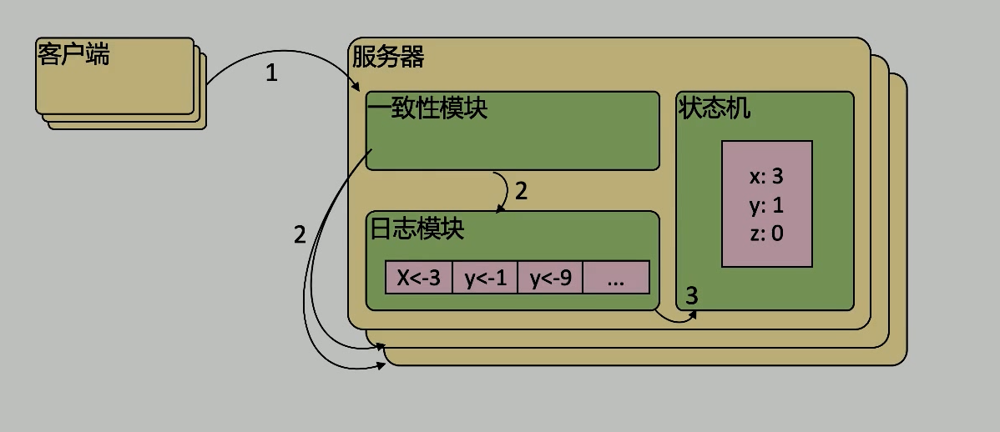

# etcd 01

etcd 是 基於 Raft 開發的分佈式 key-value 存儲, 可用於服務發現, 共享配置以及一致性保障( 如數據庫選主, 分佈式鎖等 )

在分佈式系統中, 如何管理節點的狀態一直是一個難題, etcd 像是專門為集群環境的服務發現和註冊而設計, 它提供了`數組 TTL 失效`, `數據改變監視`, `多值`, `目錄監聽`, `分佈式鎖原子操作`等功能, 可以方便的跟蹤並管理集群節點的狀態

- KV 存儲: 將數據存儲在分層組織的目錄中, 如同在標準文件系統中
- 監測變更: 檢測特定的鍵或目錄以進行更改, 並對值得更改做出反應
- 簡單: curl 可訪問的用戶的 API ( HTTP+JSON )
- 安全: 可選的 SSL 客戶端證書認證
- 快速: 但實例每秒 1000 次寫操作, 2000+次讀操作
- 可靠: 使用 Raft 算法保證一致性

## 主要功能

- KV 存儲
- 監聽機制
- key 的過期與續約機制, 用於監控和服務發現
- 原子 Compare And Swap 和 Compare And Delete, 用於分佈式鎖和 Leader 選舉

## 使用場景

- 用於 KV 存儲, 應用程序可以讀寫 etcd 中的數據
- etcd 比較多的應用場景是用於服務註冊與發現
- 基於監聽機制的分佈式異步系統

## KV 存儲

- 快
- 支持動態存儲(內存)以及靜態存儲(磁盤)
- 分佈式存儲, 可集成多節點集群
- 存儲方式, 採用類似目錄結構(b+ tree)
  - 只有葉子節點才能真正存儲數據, 相當於文件
  - 葉子結點的父節點一定是目錄, 目錄不能存儲數據

## 服務註冊與發現

- 強一致性, 高可用的服務存儲目錄
  - 基於 Raft 算法的 etcd 天生就是這樣一個強一致性, 高可用的服務器存儲目錄
- 一種註冊服務和服務健康狀況的機制
  - 用戶可以在 etcd 中註冊服務, 並且對註冊的服務配置 key TTL, 定時保持服務的心跳已達到監控健康狀態的效果

## 消息發佈與訂閱

- 在分佈式系統中, 最適用的一種組件間通信方式就是消息發佈與訂閱
- 在構建一個配置共享中心, `消息提供者`在這個`配置中心`發佈消息, 而`消息使用者`則`訂閱`他們關心的`主題`, 一旦主題有消息發佈, 就會實時通知訂閱者
- 通過這種方式可以做到分佈式系統配配置的`集中式管理`與`動態更新`
- 應用中用到的一些`配置信息`放到 etcd 上進行集中管理
- 應用在啟動時主動從 etcd 獲取一次配置消息, 同時在 etcd 節點上註冊地一個 Watcher 並等待, 以後每次配置有更新的時候, etcd 都會實時通知訂閱者, 以此達到`獲取最新配置信息`的目的

## 核心: TTL & CAS

TTL (time to live) 指的是給一個 key 設置一個有效期, 到期後這個 key 就會被自動刪掉, 這在很多分佈式鎖的實現上都會用到, 可以保證鎖的實時有效性

Atomic Compare-and-Swap (CAS) 指的是在對 key 進行賦值的時候, 客戶端需要提供一些條件, 當這些條件滿足後, 才能賦值成功, 這些條件包括:

- prevExist: key 當前賦值前是否存在
- prevValue: key 當前賦值前的值
- prevIndex: key 當前賦值前的 Index
這樣的話, key 的設置是有前提的, 需要知道這個 key 當前的具體情況才可以對其設

## Raft 協議概覽

Raft 協議基於 quorum 機制, 即大多數同意原則, 任何的變更都需超過半數的成員確認

客戶端發消息 -> 服務器 -> 一致性模塊 -> 各個日誌模塊 -> 一致性模塊等待超過半數確認 -> 寫入狀態機

[Raft動畫詳解](http://thesecretlivesofdata.com/raft/)

etcd 集群偶數個時, 會發生`投票因為票數都沒超過半數而無效`的情況

### Learner

Raft 4.2.1 引入的新角色

當出現一個 etcd 集群需要增加節點時, 新節點與 Leader 的數據差異較大, 需要較多數據同步才能跟上 leader 的最新的數據

此時 leader 的網絡帶寬很可能被用盡, 進而使得 leader 無法正常保持心跳(系統不穩定了)

進而導致 follower 重新發起投票 -> 新節點由於數據差的多, 可能發起不少無效投票, 進而導致 etcd 集群不可用

Learner 只接受數據而不參與投票, 因此增加 learner 節點時, 集群的 quorum(一致性的數量) 不變, 直到數據同步後才有資格當 follower
