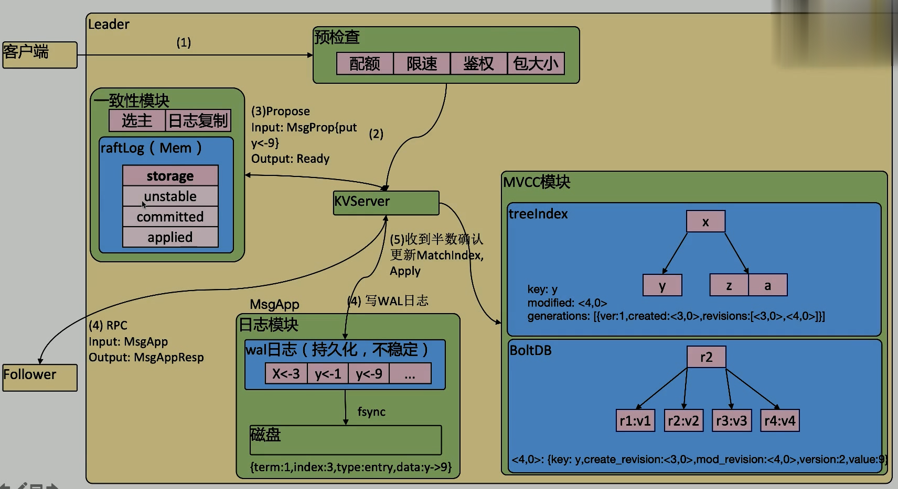

# etcd part 2

## 存儲機制

- 內存索引: kvindex: Google 開源的 Golang 的 btree 實現的
- 後端存儲: boltdb
  - 存儲的 key 是 reversion, value 是自己的 key-value 組合: 也就是說 etcd 會在 boltdb 中把每個版本都保存下來, 從而實現了多版本機制
  - reversion 分兩部分:
    - main rev: 每次事務進行加一
    - sub rev: 同一個事務中的每次操作加一

etcd 可以通過命令和設置選項控制 compact (壓縮版本)

- `etcd --enpoints=localhost:port get <key> --rev=x`
  - 可以通過設定 rev 的值來找到不同版本的結果

- 預檢查: 配額 -> 限速 -> 鑒權(etcd 提供完整的) -> 是否超過包大小
- 傳到 KVserver
- 通過 Propos() 傳到`一致性模塊`中
  - Input: MsgProp{put y<-9} (先存到 unstable 中)
  - Output: Ready
- 通過 RPC 發送給 Follower
  - Input: MsgApp
  - Output: MsgAppResp
- 收到半數確認:
  - 更新 MatchIndex (還 Get 不到)
  - Apply: 存到 MVCC 模塊
    - treeIndex
