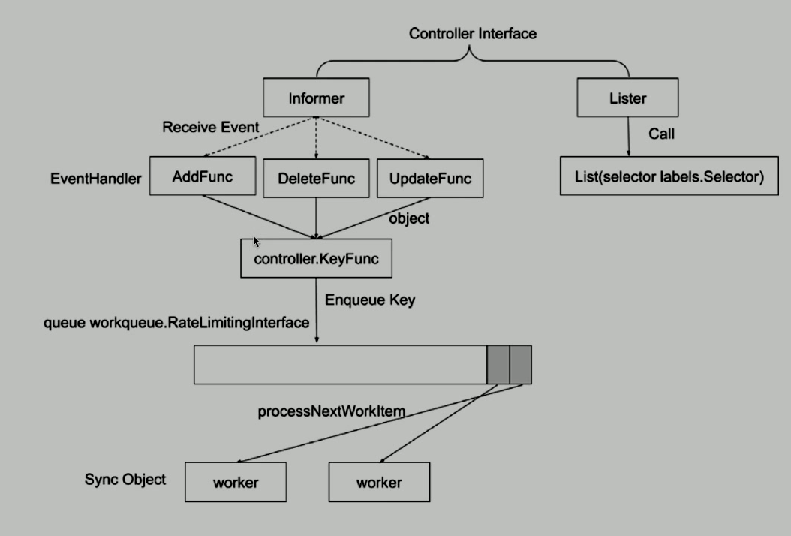
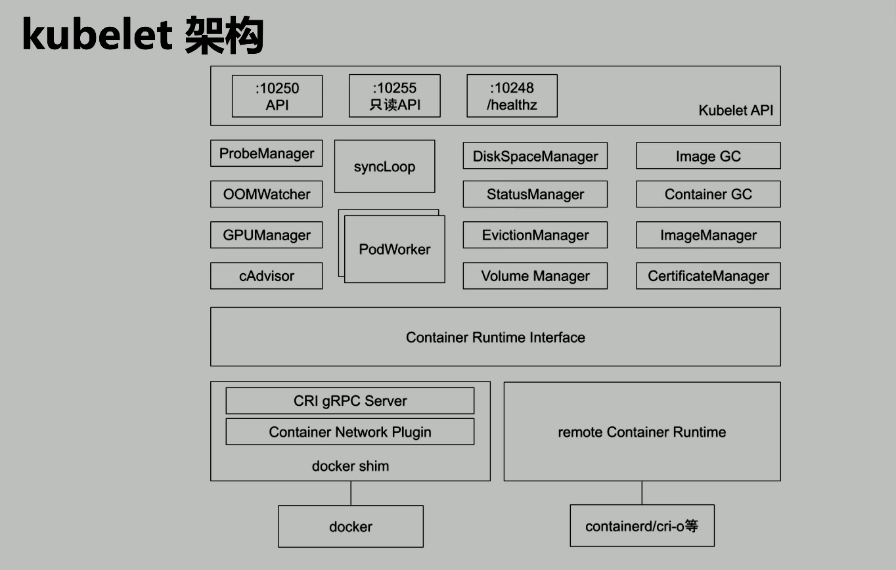
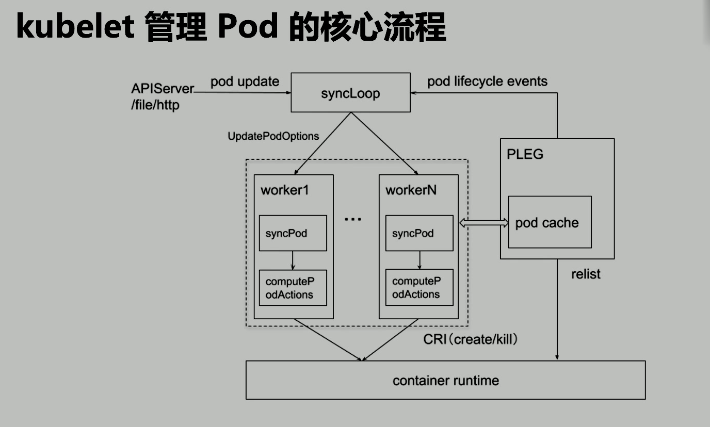

# Scheduling 02

## 控制器的工作流程

- imformer: 監聽對象(list watch)
- Lister: 維護了一份 client cache

## Controller

- Job: 處理 Job
  - 完成狀態是`Complete`而不是`Running`
- Pod AutoScaler: 處理 pod 的自動擴縮容
  - 分 VPA 和 HPA
- ReplicaSet: 依賴 ReplicaSet Spec 創建 Pod
- Service Controller: 為 LoadBalancer type 的 service 創建 LB VIP
  - 負載均衡
- ServiceAccount Controller: 確保 service account 在當前 namespace 存在
- StatefulSet controller: 處理 statefule set 中的 Pod
  - 與 replicaset 不同: 每個 pod 名字的後綴不是隨機值而是 0, 1, 2, 3...
- Volume Controller: 依據 PV spec 創建
- Namespace Controller: 保證 namespace 刪除時, 該 namespace 下的所有資源都先被刪除.
- Replication Controller: 創建 RC 後, 負責創建 POD.
- Node Controller: 維護 Node 狀態, 處理 evict 請求等
- Daemon Controller: 依據 damonset 創建 pod.
  - 監聽所有節點: 有新的節點就起新的 pod, 有節點刪除就刪除 pod
- Garbage collector: 級聯刪除

### 生產經驗

- 保護好 Controller manager 的 kubeconfig:
  - 此 kubeconfig 擁有所有資源的所有操作權限, 防止普通用戶通過`kubectl exec kube-controller-manager cat` 獲取該文件
  - 用戶可能做任何你想不到的操作, 然後找你 support

## kubelet 架構

## kubelet 管理 Pod 的核心流程

