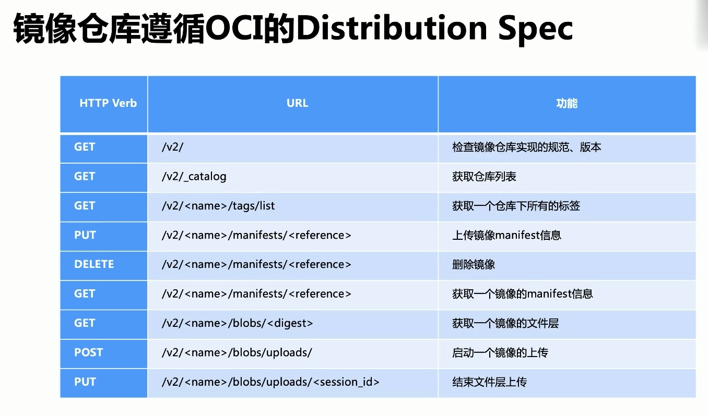
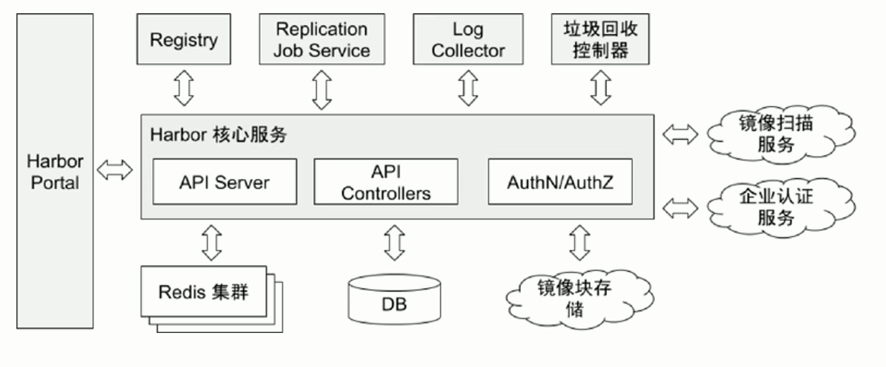

# K8s 的生產化運維

## 鏡像倉庫

鏡像倉庫 (Docker Registry) 負責存儲, 管理和分發鏡像

鏡像倉庫管理多個 Repository, Repository 通過命名來區分. 每個 Repository 包含一個或多個鏡像, 鏡像通過鏡像名和標籤(Tag)來區分

客戶端拉去鏡像時, 要指定三要素:

- 客戶鏡像: 要從哪一個鏡像倉庫拉去鏡像, 通常通過 DNS 或 IP 地址來確定一個鏡像倉庫, 如 hub.docker.com
- Repository: 組織名, 如 cncamp
- 鏡像名稱+標籤: 如 nginx:latest

生產環境正常與互聯網隔絕

### 鏡像倉庫遵循 OCI 的 Deistribution Spec

### 元數據和塊文件

鏡像由`元數據`和`塊文件`兩個部分組成, 鏡像倉庫的核心職能就是管理者兩項數據

- `元數據`
  - 元數據用於描述一個鏡像的核心信息, 包括鏡像的鏡像倉庫, 倉庫, 標籤, 校驗碼, 文件層, 鏡像構建描述等信息.
  - 通過這些信息, 可以從抽象層面完整地描述一個鏡像: 他是如何構建出來的, 運行過什麼構建命令, 構建的每一個文件層的校驗碼, 打的標籤, 鏡像的校驗碼等
- `塊文件`
  - 塊文件是組成鏡像的聯合文件層的尸體, 每一個塊文件是一個文件層, 內部包含對應文件層的變更.

### Harbor

Harbor 目前已是 CNCF 的畢業項目. 它擁有完整的倉庫管理, 鏡像管理, 基於角色的權限控制, 鏡像安全掃描集成, 鏡像簽名等.

Harbor Portal: Web 界面

### 鏡像掃描( Vulnerability Scanning )

- 分析構建指令, 應用, 文件, 依賴包
- 查 CVE(Common Vulnerabilities and Exposures) 庫, 安全策略
- 檢查鏡像是否安全, 是否符合企業的安全標準

### 鏡像策略准入控制

鏡像准入控制是在部署 Pod, 更新 Pod 時, 對 Pod 中的所有鏡像進行安全驗證以放行或攔截對 Pod 的操作

- 放行: Pod 中的所有鏡像都安全, 允許此次的操作, Pod 成功被創建或更新
- 攔截: Pod 中的鏡像未掃描, 或已經掃描但存在安全漏洞, 或不符合安全策略, Pod 無法被創建或更新

## 基於 Kubernetes 的 DevOps

### 傳統運維模式

- 缺乏一致性環境
- 平台與應用部署相互割裂
- 缺乏工具鏈支持
- 缺乏統一的灰度發佈管理
- 缺乏統一監控能力和持續運維能力

- CICD
  - CI: Continue Intergration
  - CD: Continue Deployment
