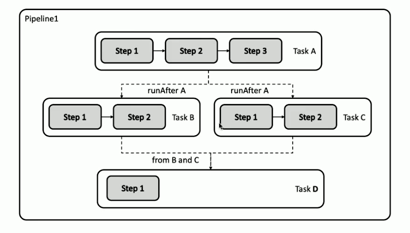

# 生產化運維

## 基於 Jekins

lgtm: look good to me.

E2E Conformance Test: 回歸測試

## Docker in Docker 問題展開

- mount host docker.socket
  docker run -v /var/run/docker.sock:/var/run/docker.sock ...

## Tekton (k8s 雲原生的)

### Jenkins 的不足

- 基於腳本的 Job 配置複用率不足
  - Jenkins 等工具的流水線作業通常基於大量不可複用的腳本語言, 如何提高代碼複用率
- 代碼調試困難
  - 如何讓流水線作業的配置更好地適應雲原生場景的需求越來越急迫
- Jenkins Master 可以帶的 Slave 數量有限
  - Slave 過多則需要分流, 維護多套 Master

### 基於聲明式 API 的流水線 - Tekton

- `自定義`: Tekton 對象是`高度自定義`的, `可擴展性極強`. 平台工程師可預定義可重用模塊以詳細的模塊目錄提供, 開發人員可在其他項目中直接引用.
- `可重用`: Tekton 對象的可重用性強, 組件只需一次定義, 即可被組織內的任何人在任何流水線都可重用. 使得開發人員無需重複造輪子即可構建複雜流水線.
- `可擴展性`: Tekton 組建目錄(Tekton Catalog) 是一個社區驅動的 Tekton 組件的存儲倉庫. 任何用戶可以直接從社區獲取成熟的組件並在此之上構建複雜流水線, 也就是當你要構建一個流水線時, 很可能你需要的所有代碼和配置都可以從 Tekton Catalog 直接拿下來複用, 而無需重複開發.
- `標準化`: Tekton 作為 Kubenetes 集群的擴展安裝和運行, 並使用業界公認的 Kubernetes 資源模型; Tekton 作業以 Kubernetes 容器形態執行
- `規模化支持`: 只需增加 Kubernetes 節點, 即可增加作業處理能力. Tekton 的能力可依照集群規模隨意擴充, 無需重新定義資源分配需求或者重新定義流水線.

### Tekton 核心組件

- Pipeline: 對象定義了一個流水線作業, 一個 Pipeline 對象由一個或數個 Task 對象組成.
- Task: 一個可獨立運行的任務, 如獲取代碼, 編譯, 或者推送鏡像等等, 當流水線被運行時, Kubernetes 會為每個 Task 創建一個 Pod. 一個 Task 由多個 Step 組成, 每個 Step 體現為這個 Pod 中的一個容器.
  

## argocd

### 使用場景

1. 低成本的 Gitops 利器
2. 多集群管理
   1. 不同目的集群: 測試, 集成, 預生產, 生產
   2. 多生產集群管理
 f
